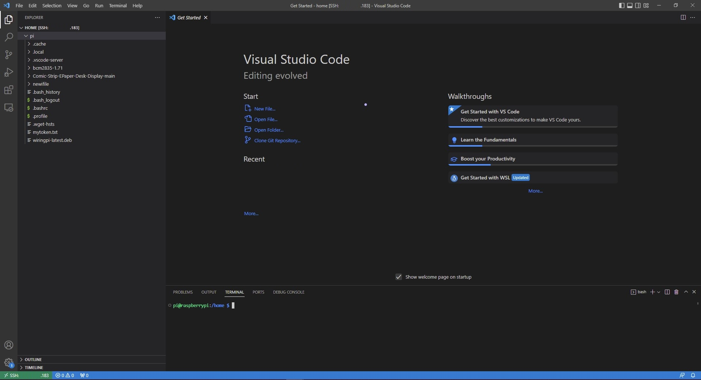
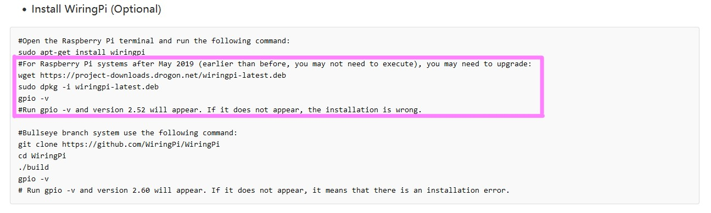

### The main goal of this project is to create a display for my desk that shows that current day's comic. As of right now this is based on the [5.65inch ACeP 7-Color E-Paper from waveshare](https://www.waveshare.com/product/displays/e-paper/epaper-1/5.65inch-e-paper-module-f.htm) and an Raspberry Pi Zero 2 W

The main idea is that the RPI will web scrape for the comic strip image and then convert it from GIF to BMP format. Then, with the newly formated image it will be displayed. Thank you Robert W. Floyd and Louis Steinberg for creating the first image [dithering algorithm](https://en.wikipedia.org/wiki/Floyd%E2%80%93Steinberg_dithering)

## Setting up the [Raspbeery Pi Zero 2 W](https://www.raspberrypi.com/products/raspberry-pi-zero-2-w/)

I am still figuring out which steps I would recommend to start with first but this is an alternative to doing all of this via command line. This is a [link](https://youtu.be/yVW8LftDSwg?t=209) to a youtube video titled "C Programming on a Headless Raspberry Pi Part 1: VSCode Server Setup (Pi Zero 2 W)" by "Learn Embedded Systems" and they go through a great way to connect the to RPI and still have a gui. KEEP IN MIND WE DO NOT CARE ABOUT COMPILING OR RUNNING ANY C PROGRAMS THAT ARE DISCUSSED IN THE VIDEO. ONLY DO THE VSCODE RPI INTEGRATION. After you are done your VSCode should look a little something like the photo below. Import areas are surrounded by a pink box.

Wave Share gave an amazing tutorial on how to set up the RPI. Here is the [link](https://www.waveshare.com/wiki/5.65inch_e-Paper_Module_(F)_Manual#Working_With_Raspberry_Pi), If you follow it (minus one instruction) you should be able to get up and going pretty fast. The only issue I ran into was getting an error after running the command "sudo apt-get install wiringpi". Just skip the command and follow the instructions in the pink box in the image below.

